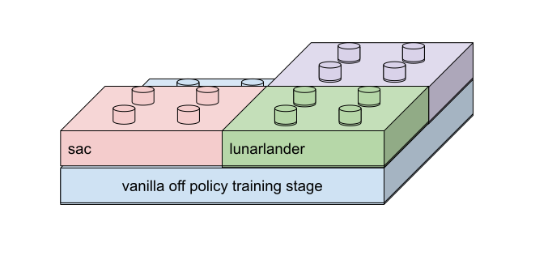

<div id="top"></div>
<!-- from https://github.com/othneildrew/Best-README-Template -->


<!-- PROJECT LOGO -->
<br />
<div align="center">
  <a href="https://github.com/github_username/repo_name">
    
  </a>

<h3 align="center">RL Framework</h3>

  <p align="center">
    This is a project that implements some Reinforcement Learning algorithm.
    <!-- <br />
    <a href="https://github.com/github_username/repo_name"><strong>Explore the docs »</strong></a>
    <br />
    <br />
    <a href="https://github.com/github_username/repo_name">View Demo</a>
    ·
    <a href="https://github.com/github_username/repo_name/issues">Report Bug</a>
    ·
    <a href="https://github.com/github_username/repo_name/issues">Request Feature</a> -->
  </p>
</div>


<!-- TABLE OF CONTENTS -->
<details>
  <summary>Table of Contents</summary>
  <ol>
    <li>
      <a href="#about-the-project">About The Project</a>
    </li>
    <li>
      <a href="#architecture-explanation">Architecture Explanation</a>
      <ul>
        <li><a href="#main-stage">Main Stage</a></li>
        <li><a href="#environment">Environment</a></li>
        <li><a href="#rl-algorithm">RL Algorithm</a></li>
        <li><a href="#replay-buffer">Replay Buffer</a></li>
      </ul>
    </li>
    <li><a href="#usage">Usage</a></li>
  </ol>
</details>


<!-- ABOUT THE PROJECT -->
## About The Project

<!-- [![Product Name Screen Shot][product-screenshot]](https://example.com) -->
This is a RL framework that aims to improve the development speed of RL algorithms. Each component of a RL algorithm is seperated clearly by different module so as to achive high maintainability and flexibility. This project is not developed based on stable baseline or openai spinning up (some of the hyper-parameter or model implementation are inspired by them) so that it can be more flexible and easy to understand. The main goal of this project is to provide a clear and easy-to-understand codebase for RL researchers and developers to easily develop and test their own algorithms instead of being stuck in the complex or delicate codebase that is hard to trace and modify. 

<p align="right">(<a href="#top">back to top</a>)</p>


## Architecture Explanation
The code is divided into several different types of modules, including `main stage`,`environment`, `RL algorithm`, `replay buffer`, `configuration`. All of these modules are designed to be independent of each other, so that you can easily replace one module with another module that has the same interface. For example, you can easily replace the DDPG algorithm with the TD3 algorithm, or replace the gym environment with a custom environment, etc.
### Main Stage


`Main stage` controls the whole workflow of the entire experiment. For example, training and testing of a RL agent can be a main stage, collecting trajectory data from a pretrained agent can also be a main stage, etc.
### Environment


`Environment` provides the environment for the RL agent to interact with. It can be a gym environment or a custom environment. User can choose different environment wrapper for the chosen environment or create your own one.
### RL Algorithm


`RL algo` implements some of the most popular RL algorithms, including DQN, DDPG, TD3, SAC, PPO,...
### Replay Buffer


`Replay buffer` includes different kinds of replay buffers. For example, the normal replay buffer, the hindsight experience replay buffer and the replay buffer for onpolicy training are implemented in this project.
<!-- ### configuration
Configurations of RL algorithms. -->
<!-- GETTING STARTED -->
<!-- ## Getting Started

This is an example of how you may give instructions on setting up your project locally.
To get a local copy up and running follow these simple example steps. -->

<!-- ### Prerequisites

This is an example of how to list things you need to use the software and how to install them.
* npm
  ```sh
  npm install npm@latest -g
  ``` -->

<!-- ### Installation

1. Get a free API Key at [https://example.com](https://example.com)
2. Clone the repo
   ```sh
   git clone https://github.com/github_username/repo_name.git
   ```
3. Install NPM packages
   ```sh
   npm install
   ```
4. Enter your API in `config.js`
   ```js
   const API_KEY = 'ENTER YOUR API';
   ```

<p align="right">(<a href="#top">back to top</a>)</p> -->


<!-- USAGE EXAMPLES -->
## Usage

use `get_rl_agent`, `get_env`, `get_replay_buffer`, `get_main_stage` function as the interface to access the modules.

```python:
config, config_text = get_config()
env = get_env(config.env, config.wrapper_type)
agent = get_rl_agent(env, config)
storage = get_replay_buffer(env, config)
main_fn = get_main_stage(config)
```

then you can execute your task with the following code

```python:
main_fn.start(agent, env, storage)
```
just like all the blocks are assembled

<p align="right">(<a href="#top">back to top</a>)</p>


<!-- ROADMAP -->
## TODO

- [ ] discrete sac
- [ ] ppo
- [ ] rainbow
    - [ ] double
    - [ ] dueling
    - [ ] PER
    - [ ] noisynet
    - [ ] n-step TD
    - [ ] distributional
- [ ] some imitaion learning algo
- [ ] distributed RL
<!-- See the [open issues](https://github.com/github_username/repo_name/issues) for a full list of proposed features (and known issues). -->

<p align="right">(<a href="#top">back to top</a>)</p>


<!-- CONTRIBUTING -->
<!-- ## Contributing

Contributions are what make the open source community such an amazing place to learn, inspire, and create. Any contributions you make are **greatly appreciated**.

If you have a suggestion that would make this better, please fork the repo and create a pull request. You can also simply open an issue with the tag "enhancement".
Don't forget to give the project a star! Thanks again!

1. Fork the Project
2. Create your Feature Branch (`git checkout -b feature/AmazingFeature`)
3. Commit your Changes (`git commit -m 'Add some AmazingFeature'`)
4. Push to the Branch (`git push origin feature/AmazingFeature`)
5. Open a Pull Request

<p align="right">(<a href="#top">back to top</a>)</p> -->


<!-- LICENSE -->
<!-- ## License

Distributed under the MIT License. See `LICENSE.txt` for more information.

<p align="right">(<a href="#top">back to top</a>)</p> -->


<!-- CONTACT -->
<!-- ## Contact

Your Name - [@twitter_handle](https://twitter.com/twitter_handle) - email@email_client.com

Project Link: [https://github.com/github_username/repo_name](https://github.com/github_username/repo_name)

<p align="right">(<a href="#top">back to top</a>)</p> -->


<!-- ACKNOWLEDGMENTS -->
<!-- ## Acknowledgments

* []()
* []()
* []()

<p align="right">(<a href="#top">back to top</a>)</p> -->


<!-- MARKDOWN LINKS & IMAGES -->
<!-- https://www.markdownguide.org/basic-syntax/#reference-style-links -->
[contributors-shield]: https://img.shields.io/github/contributors/github_username/repo_name.svg?style=for-the-badge
[contributors-url]: https://github.com/github_username/repo_name/graphs/contributors
[forks-shield]: https://img.shields.io/github/forks/github_username/repo_name.svg?style=for-the-badge
[forks-url]: https://github.com/github_username/repo_name/network/members
[stars-shield]: https://img.shields.io/github/stars/github_username/repo_name.svg?style=for-the-badge
[stars-url]: https://github.com/github_username/repo_name/stargazers
[issues-shield]: https://img.shields.io/github/issues/github_username/repo_name.svg?style=for-the-badge
[issues-url]: https://github.com/github_username/repo_name/issues
[license-shield]: https://img.shields.io/github/license/github_username/repo_name.svg?style=for-the-badge
[license-url]: https://github.com/github_username/repo_name/blob/master/LICENSE.txt
[linkedin-shield]: https://img.shields.io/badge/-LinkedIn-black.svg?style=for-the-badge&logo=linkedin&colorB=555
[linkedin-url]: https://linkedin.com/in/linkedin_username
[product-screenshot]: images/screenshot.png
